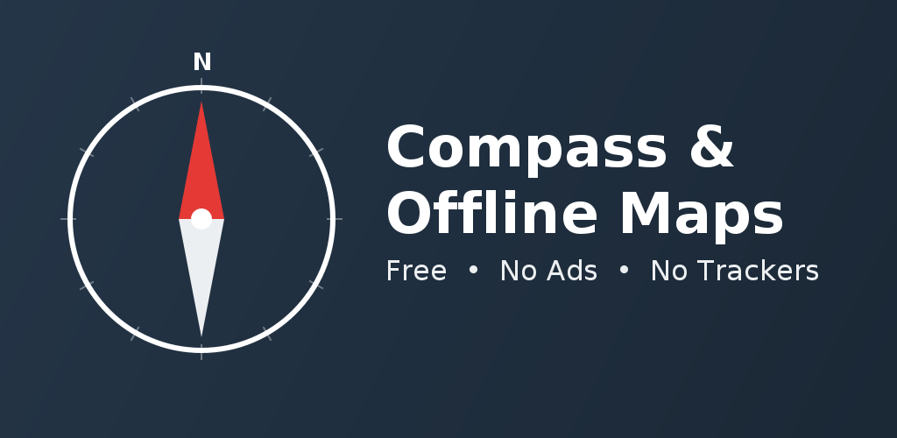

# Compass & Offline Maps



[](https://github.com/bryanjhogan/compass/actions/workflows/ci.yml)
[](https://github.com/bryanjhogan/compass/actions/workflows/release.yml)
[](LICENSE)

A simple, honest Android compass app — no ads, no account, no tracking of any kind.

## Features

- Compass with magnetic and true heading, live calibration status
- Bubble level for checking flat surfaces
- Interactive map with your current position, powered by OpenStreetMap
- Download map areas for offline use — take them hiking, camping, or anywhere without signal
- Address lookup and GPS accuracy/altitude display

## Why this app

- Completely free, with no ads
- No analytics, no trackers, no data collection of any kind — nothing is sent to us, ever
- Open source — the code is public, so you don't have to take our word for it
- No account or sign-up required
- Works offline once you've downloaded your map area

## Screenshots

<p align="center">
  
  
  
  
</p>

## Install

This app isn't on the Play Store. Signed release APKs are published automatically to the [Releases](https://github.com/bryanjhogan/compass/releases) page whenever a new version tag is cut.

1. Go to [Releases](https://github.com/bryanjhogan/compass/releases) and download the latest `.apk`.
2. On your device, open the downloaded file. If prompted, allow installs from this source (Android will ask the first time you install an app from outside the Play Store).
3. Install and open the app.

Requires Android 8.0 (API 26) or newer.

## Building from source

Requires JDK 17 and the Android SDK.

```bash
git clone https://github.com/bryanjhogan/compass.git
cd compass

./build.sh              # debug APK
./build.sh --release    # release APK (unsigned unless you provide your own keystore.properties)
./build.sh --install    # build debug and install on a connected device/emulator via adb
```

Or use Gradle directly:

```bash
./gradlew assembleDebug
```

## Permissions

Location is used only to show your position on the compass and map — it never leaves your device except as part of normal map tile requests to OpenStreetMap when you're online.

## Privacy

The app collects no personal data, analytics, or usage tracking of any kind. See the full [Privacy Policy](PRIVACY_POLICY.md) for details.

## Tech stack

- Kotlin + Jetpack Compose
- [osmdroid](https://github.com/osmdroid/osmdroid) for OpenStreetMap-based mapping (no Google Play Services dependency)
- Platform `LocationManager` for positioning

## License

Released into the public domain under the [Unlicense](LICENSE) — do whatever you want with it.
